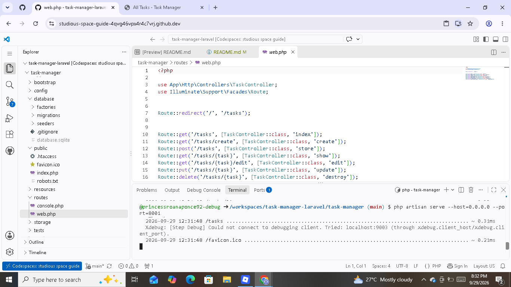
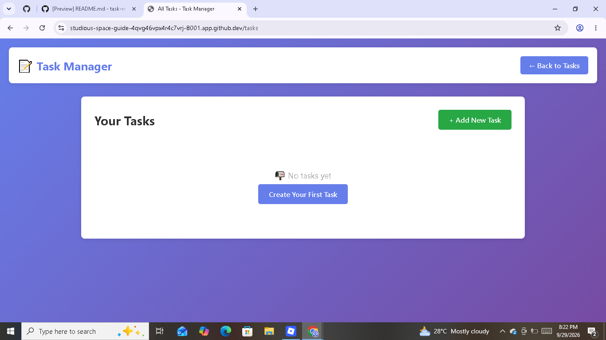
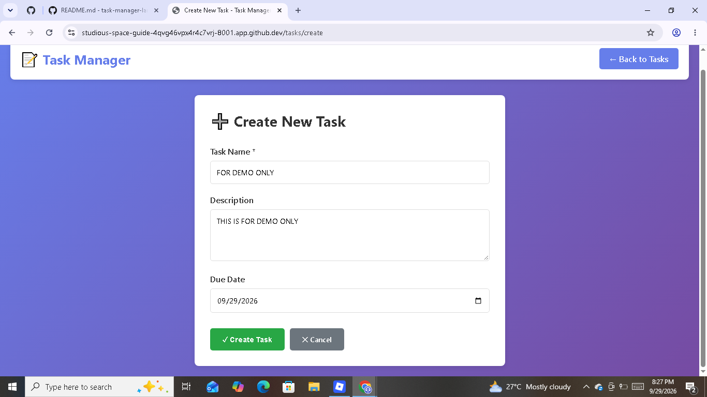
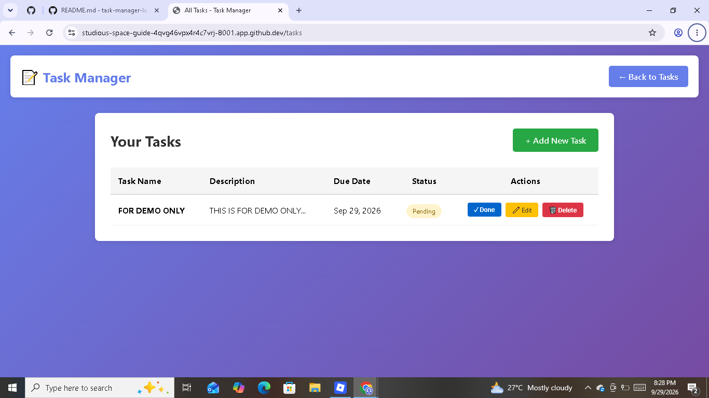
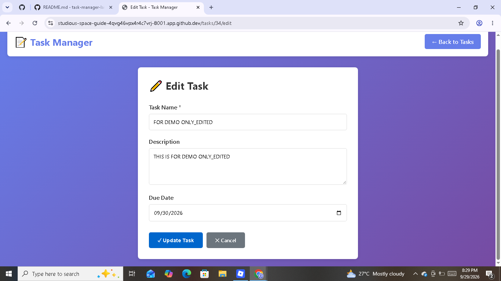
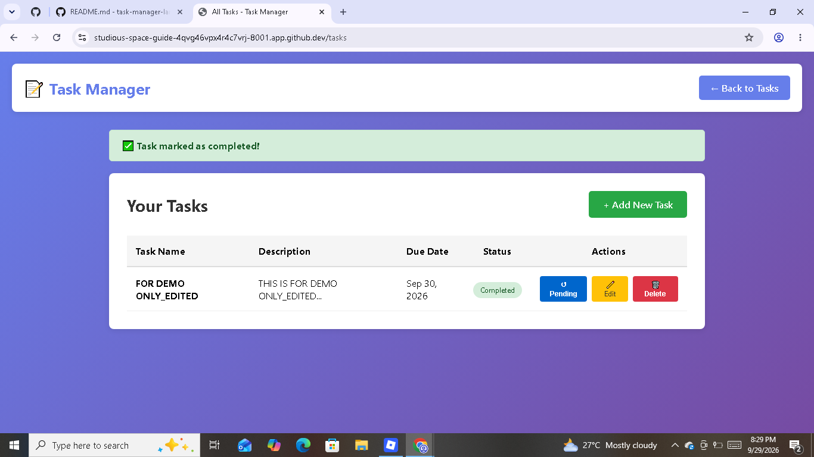
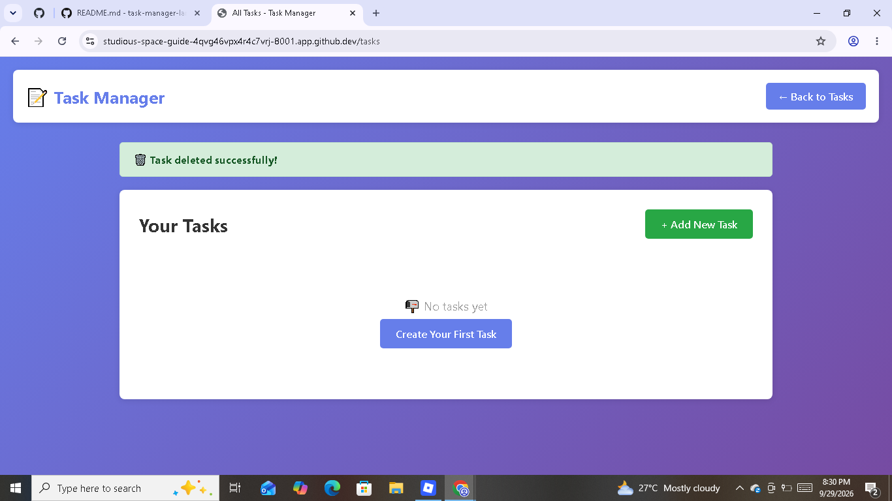

# Personal Task Manager - Laravel

## Project Information
- Project Code: WST21-PM-2026-SF
- Student Name: Princess Roana D. Ponce
- Course & Year: BSIT-2 Section-01
- Database Used: SQLite

## Features
-  Add Task
-  View Tasks
-  Edit Task
-  Delete Task
-  Update Status (Pending/Completed)

## SCREENSHOTS FOR UI AND STEOS BY STEPS HOW IT WORKS

## MY SYSTEM

## # Step-by-Step Process of the Task Management System

1. **Open the System**
   The user opens the Task Management System through the provided website link. The main page displays the available tasks and the options for managing them.
   
   

3. **Create a Task**
   The user clicks the **Create a Task** button. The user enters the task name and description, then saves the task.

   

4. **View the Task**
   After saving, the newly created task appears in the task list. The user can view the task name, description, and its current status.

   

5. **Edit a Task**
   If the user wants to change the task information, they click the **Edit** option. The user updates the task details and saves the changes.

7. **Mark a Task as Done**
   When the user finishes a task, they click the **Done/Complete** option. The system updates the task to show that it has been completed.

 
 
8. **Delete a Task**
   If a task is no longer needed, the user can click the **Delete** option. The system removes the selected task from the task list.

   

10. **Manage Tasks**
   The user can repeat these actions whenever needed. The system allows the user to create, view, edit, complete, and delete tasks in an organized way.

